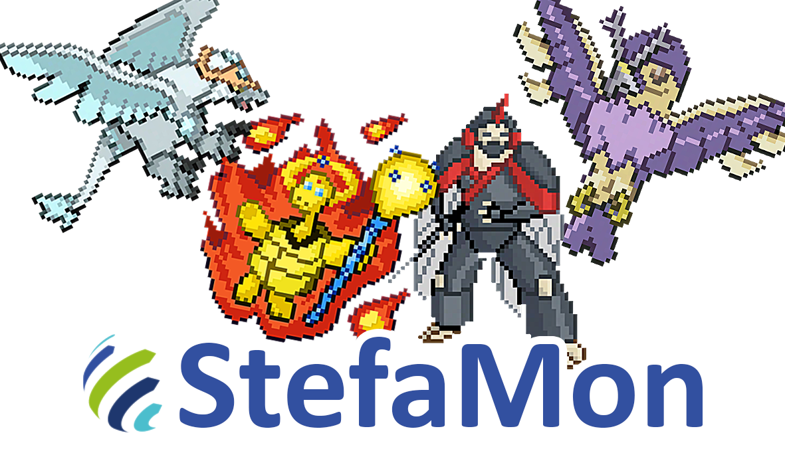

### HackathonAngular
# StefaMon:
### StefaMon é um sistema de rinha de criaturas mágicas onde jogadores disputam batalhas acirradas em busca de ser o melhor treinador. Vença as batalhas e conquiste seu lugar no ranking.

# Objetivo:
## Adequar o Front-end de acordo com os requisitos do [Back-end](./desafio/StefaMon.pdf)

---

# Arquitetura do projeto
- [Instruções Arquiteturais](./Instruções.md)

Projeto gerado usando [Angular CLI](https://v10.angular.io/docs) versão 10.2.4.

## Pré-Requisitos

NodeJS: [v10.24.1](https://nodejs.org/docs/latest-v10.x/api/)

Npm: v6.14.12

PrimeNg [v10.0.0](https://www.primefaces.org/primeng-v10-lts/)

## Servidor de Desenvolvimento

Execute `ng serve`. Link de acesso: http://localhost:4200/

## Criar um Component

Execute `ng generate component component-name` para gerar um novo component. Você tambem pode usar `ng generate directive|pipe|service|class|guard|interface|enum|module`.

## Build (Não vai precisar)

Execute `ng build`. Os artefatos gerados ficaram em `dist/`. Pode usar a flag `--prod` pra build de produção.

## Para Ajuda

Use `ng help` ou visite [Angular IO](https://v10.angular.io/docs).

## Links Úteis
- https://www.primefaces.org/primeng-v10-lts/#/
- https://www.primefaces.org/primeflex
- https://www.primefaces.org/primeng-v10-lts/#/icons

